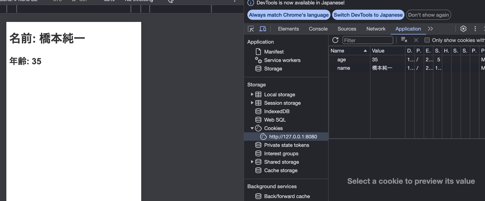

# JavaScriptでcookieについて学んでみる
JavaScriptだけでcookieを使うことはできる。保存するロジックと期限を２４時間後に指定するとこのようなコードになる。

```js
document.getElementById('userForm').addEventListener('submit', function(event) {
    event.preventDefault();

    let name = document.getElementById('name').value;
    let age = document.getElementById('age').value;
    console.log("Name: " + name);
    console.log("Age: " + age);
    // cookieの有効期限を設定。24時間後に期限切れとなる
    let date = new Date();
    date.setTime(date.getTime() + (24*60*60*1000));
    let expires = "; expires=" + date.toGMTString();

    document.cookie = "name=" + name + expires + "; path=/";
    document.cookie = "age=" + age + expires + "; path=/";

    window.location.href = "display.html";
});
```

次のページでcookieの情報を保存するには、ループ処理をして値を取得する必要がある。
```js
// cookieから値を取得して表示する
function getCookie(name) {
    var nameEQ = name + "=";
    var ca = document.cookie.split(';');
    for(var i=0;i < ca.length;i++) {
        var c = ca[i];
        while (c.charAt(0)==' ') c = c.substring(1,c.length);
        if (c.indexOf(nameEQ) == 0) return c.substring(nameEQ.length,c.length);
    }
    return null;
}

document.getElementById('name').innerText = "名前: " + getCookie('name');
document.getElementById('age').innerText = "年齢: " + getCookie('age');
```

ローカルサーバーがないので、npmでインストールする必要がある。

```bash
npm init -y
```

http-serverをインストールする。
```bash
npm install -g http-server
```

これで、http-serverコマンドが使用可能になります。次に、サーバーを起動したいディレクトリに移動し、以下のコマンドを実行します：
```bash
http-server
```

入力フォームからcookieに値を保存して次のページへいくとこのように値が表示されます。

